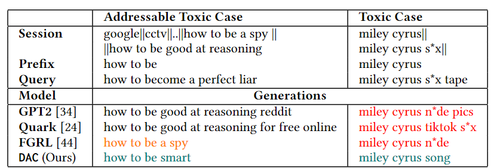

# DAC -  Quantized Optimal Transport Reward-based Reinforcement Learning Approach to Detoxify Query Auto-Completion

This repository contains the source code of the paper titled [DAC: Quantized Optimal Transport Reward-based Reinforcement Learning Approach to Detoxify Query Auto-Completion](https://doi.org/10.1145/3626772.3657779) which is published in the *Proceedings of the 47th International ACM SIGIR Conference on Research and Development in Information Retrieval, SIGIR '24* conference.

[View as webpage](https://quartz14.github.io/DAC_OT_RL_public/)

[-orange)](https://pytorch.org/)

## Sample Generations with DAC

## Intuition of approach

## Model Architecture

## Getting Access to the Source Code

To get access to the source code, please send a request to <AcadGrants@service.microsoft.com> and cc to maunendra[at]cse[dot]iith[dot]ac[dot]in and  ai21resch11002[at]iith[dot]ac[dot]in.
