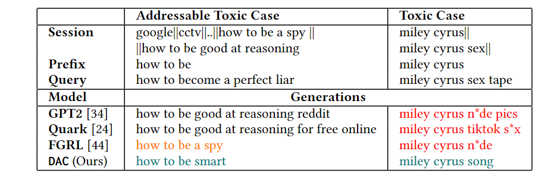
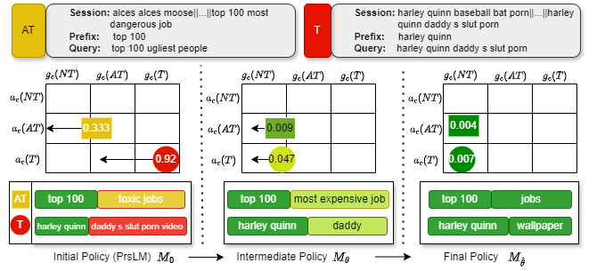

## Table of Contents

- [Abstract](#abstract)
- [Paper](#paper)
- [Getting Access](#getting-access-to-the-source-code-or-pretrained-models)
- [Intuition](#intuition)
- [Acknowledgements](#acknowledgements)


## Abstract

Modern Query Auto-Completion (QAC) systems utilize natural language generation (NLG) using large language models (LLM) to achieve remarkable performance. However, these systems are prone to generating biased and toxic completions due to inherent learning biases. Existing detoxification approaches exhibit two key limitations: 
1. They primarily focus on mitigating toxicity for grammatically well-formed long sentences but struggle to adapt to the QAC task, where queries are short and structurally different (include spelling errors, do not follow grammatical rules and have relatively flexible word order).
2. These approaches often view detoxification through a binary lens where all text labeled as toxic is undesirable and non-toxic is considered desirable.
To address these limitations, we propose _DAC_, an intuitive and efficient reinforcement learning-based model to detoxify QAC. With _DAC_, we introduce an additional perspective of considering the third query class of **addressable** toxicity. These queries can encompass implicit toxicity, subjective toxicity, or non-toxic queries containing toxic words. We incorporate this three-class query behavior perspective into the proposed model through **quantized optimal transport** to learn distinctions and generate truly non-toxic completions. We evaluate toxicity levels in the generated completions by _DAC_ across two real-world QAC datasets (Bing and AOL) using two classifiers: a publicly available generic classifier (Detoxify) and a search query-specific classifier, which we develop (TClassify). we find that _DAC_ consistently outperforms all existing baselines on the Bing dataset and achieves competitive performance on the AOL dataset for query detoxification.


Example generation of __DAC__ (proposed model) and other baseline models

## Paper

- The _DAC_ model was proposed in our SIGIR 2024 paper - [**_DAC_: Quantized Optimal Transport Reward-based Reinforcement Learning Approach to Detoxify Query Auto-Completion**](https://doi.org/10.1145/3626772.3657779).

## Getting Access to the Source Code or Pretrained Models

To get access to the source-code or pretrained-model checkpoints, please send a request to [AcadGrants@service.microsoft.com](mailto:AcadGrants@service.microsoft.com) and cc to *maunendra[at]cse[dot]iith[dot]ac[dot]in and ai21resch11002[at]iith[dot]ac[dot]in*.


### Note

The requesting third party
1. **Can download and use these deliverables for research as well as commercial use,**
2. **Modify it as they like but should include citation to our work and include this readme**, and
3. **Cannot redistribute strictly to any other organization.**

**Cite As**

```bibtex
@inproceedings{DAC_2024,
  title={Representation Learning for Conversational Data using Discourse Mutual Information Maximization},
  author={Aishwarya Maheswaran, Kaushal Kumar Maurya, Manish Gupta, Maunendra Sankar Desarkar},
  booktitle={Proceedings of the 47th International ACM SIGIR Conference on Research and Development in Information Retrieval (SIGIR '24), July 14--18,2024, Washington, DC, USA},
  year={2024},
  acmISBN={979-8-4007-0431-4/24/07},
  acmDOI={10.1145/3626772.3657779},
  
}
```

## Intuition


In this figure, we illustrate the detoxification process of completions during the training of _DAC_ for two queries: one from the $T_{test}$ (indicated with red)  and another from the $AT_{test}$ set (indicated with yellow). The model training goes through three key stages: the initial model ($M_0$), the intermediate model ($M_\theta$), and the final model ($M_{\hat{\theta}}$). We also provide information about the corresponding quantiles and TClassify scores. For the toxic query, the completions generated by $M_0$ are initially toxic. However, as the model training progresses, particularly with $M_\theta$, it successfully steers the generation closer to non-toxicity, finally producing non-toxic completions with $M_{\hat{\theta}}$. A similar trend is observed for the AT query. Additionally, final generated completions closely resemble the actual reference completions, indicating a high degree of lexical overlap with the reference. In summary, _DAC_ learns the detoxification stage wise and ensures that the generated completions are non-toxic and not too far from the actual reference completion. 


## Acknowledgements

This work was partially supported by Microsoft Academic Partnership Grant (MAPG) 2022-2023.

<!-- ## Requirements

- wandb
- transformers
- datasets
- torch 1.8.2 (lts)

## How to run?

### Loading and Finetuning the model for a task

For finetuning the model on the tasks mentioned in the paper, or on a new task, use the `run_finetune.py` script or modify it according to your requirements. Example commands for launching finetuning based on some DMI checkpoints can be found in the `auto_eval` directory.

### Pretraining Dataset

There are two types of dataset structure that are available for model pretraining.

In case of smaller or **"Normal"** datasets, a single train_dialog file contains all the training data and is consumed fully during each epoch.

In case of **"Large"** datasets, the files are split into smaller shards and saved as .json files.

1. **Normal Datasets**: For example of this, check the `data/dailydialog` or `data/reddit_1M` directories.
```sh
data/reddit_1M
├── test_dialogues.txt
├── train_dialogues.txt
└── val_dialogues.txt
```
2. **Large Datasets**: This mode can be activated by setting the `--dataset` argument to `rMax`, i.e., `--dataset rMax` or `-dd rMax`. This also require you to provide the `-rmp` argument for the directory path containing the json files. For validation during pretraining, this model uses the DailyDialog validation set by default.
```sh
data/rMax-subset
├── test-00000-of-01000.json
├── test-00001-of-01000.json
├── test-00002-of-01000.json
├── test-00003-of-01000.json
├── ...
├── train-00000-of-01000.json
├── train-00001-of-01000.json
├── train-00002-of-01000.json
├── train-00003-of-01000.json
└── ...
```

### For training a model

To train a new model, it can be started using the pretrain.py script.

**Example:**

1. For training from scratch:
```bash
python pretrain.py \
  -dd rMax -voc roberta \
  --roberta_init \
  -sym \
  -bs 64 -ep 1000 -vi 400 -li 50 -lr 5e-5 -scdl \
  --data_path ./data \
  -rmp /disk2/infonce-dialog/data/r727m/ \
  -t 1 \
  -ddp --world_size 6 \
  -ntq
```
2. To resume training from an existing checkpoint: This example shows resuming training from a checkpoint saved under `checkpoints/DMI-Small_BERT-26Jan/`. Also note how we specify a name an existing BERT/RoBERTa model which defines the architecture and the original initialization of the model weights.
```
python pretrain.py \
  -dd rMax -voc bert \
  --roberta_init \
  -robname google/bert_uncased_L-8_H-768_A-12 \
  -sym -bs 130 -lr 1e-5 -scdl -ep 1000 -vi 400 -li 50 \
  --data_path ./data \
  -rmp /disk2/infonce-dialog/data/r727m/ \
  -ddp --world_size 4 \
  -ntq -t 1 \
  -re -rept checkpoints/DMI-Small_BERT-26Jan/model_current.pth
```

**It accepts the following arguments.**

```
  -h, --help            show this help message and exit
  -dd {dd,r5k,r100k,r1M,r1M/cc,rMax,rMax++,paa,WoW}, --dataset {dd,r5k,r100k,r1M,r1M/cc,rMax,rMax++,paa,WoW}
                        which dataset to use for pretraining.
  -rf, --reddit_filter_enabled
                        Enable reddit data filter for removing low quality dialogs.
  -rmp RMAX_PATH, --rmax_path RMAX_PATH
                        path to dir for r727m (.json) data files.
  -dp DATA_PATH, --data_path DATA_PATH
                        path to the root data folder.
  -op OUTPUT_PATH, --output_path OUTPUT_PATH
                        Path to store the output ``model.pth'' files
  -voc {bert,blender,roberta,dgpt-m}, --vocab {bert,blender,roberta,dgpt-m}
                        mention which tokenizer was used for pretraining? bert or blender
  -rob, --roberta_init  Initialize transformer-encoder with roberta weights?
  -robname ROBERTA_NAME, --roberta_name ROBERTA_NAME
                        name of checkpoint from huggingface
  -d D_MODEL, --d_model D_MODEL
                        size of transformer encoders' hidden representation
  -d_ff DIM_FEEDFORWARD, --dim_feedforward DIM_FEEDFORWARD
                        dim_feedforward for transformer encoder.
  -p PROJECTION, --projection PROJECTION
                        size of projection layer output
  -el ENCODER_LAYERS, --encoder_layers ENCODER_LAYERS
                        number of layers in transformer encoder
  -eh ENCODER_HEADS, --encoder_heads ENCODER_HEADS
                        number of heads in tformer enc
  -sym, --symmetric_loss
                        whether to train using symmetric infonce
  -udrl, --unsupervised_discourse_losses
                        Additional unsupervised discourse-relation loss components
  -sdrl, --supervised_discourse_losses
                        Additional supervised discourse-relation loss components
  -es {infonce,jsd,nwj,tuba,dv,smile,infonce/td}, --estimator {infonce,jsd,nwj,tuba,dv,smile,infonce/td}
                        which MI estimator is used as the loss function.
  -bs BATCH_SIZE, --batch_size BATCH_SIZE
                        batch size during pretraining
  -ep EPOCHS, --epochs EPOCHS
                        epochs for pretraining
  -vi VAL_INTERVAL, --val_interval VAL_INTERVAL
                        validation interval during training
  -li LOG_INTERVAL, --log_interval LOG_INTERVAL
                        logging interval during training
  -lr LEARNING_RATE, --learning_rate LEARNING_RATE
                        set learning rate
  -lrc, --learning_rate_control
                        LRC: outer layer and projection layer will have faster LR and rest will be LR/10
  -t {0,1}, --tracking {0,1}
                        whether to track training+validation loss wandb
  -scdl, --use_scheduler
                        whether to use a warmup+decay schedule for LR
  -ntq, --no_tqdm       disable tqdm to create concise log files!
  -ddp, --distdp        Should it use pytorch Distributed dataparallel?
  -ws WORLD_SIZE, --world_size WORLD_SIZE
                        world size when using DDP with pytorch.
  -re, --resume         2-stage pretrain: Resume training from a previous checkpoint?
  -rept RESUME_MODEL_PATH, --resume_model_path RESUME_MODEL_PATH
                        If ``Resuming'', path to ckpt file.
``` -->
